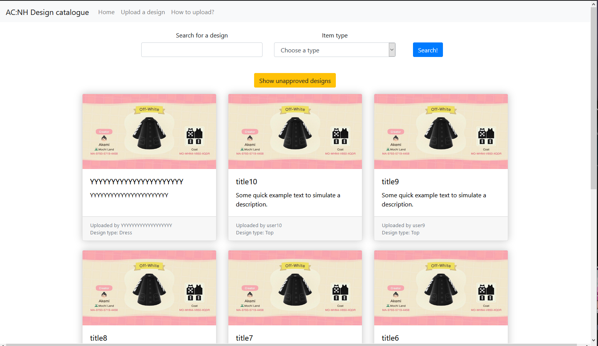
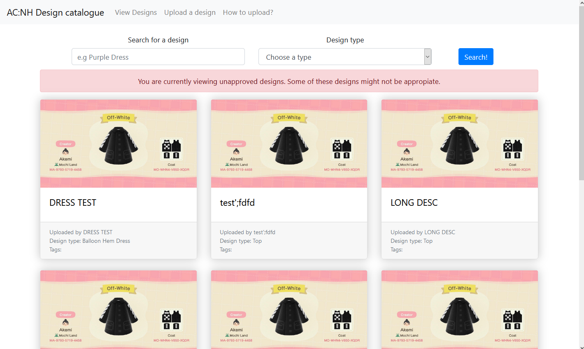
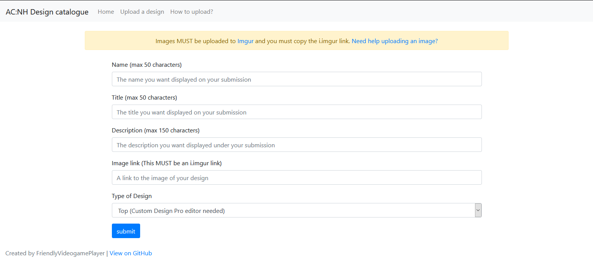
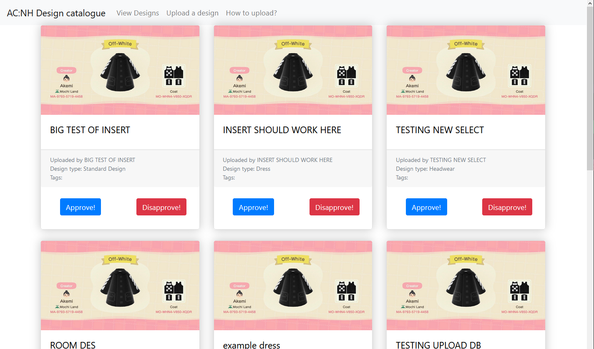

## ACNH: Design Catalogue
This was going to be a site where users could share their shareable codes in the game Animal Crossing: New Horizons for designs. Unfortunately someone else managed to finish this concept before I did and has gathered a large userbase in just a matter of hours and so this project is no longer recieving more development.

It works by users going to the upload page and then filling in the form and linking an image for their design. The design is then added to the DB but has a value of 0 in the approved column. On the designs page only designs with an approved value of 1 get displayed. There is a view to view the unapproved designs by clicking on the button on the designs page however it is accompanied by a warning since those designs might not be appropiate. Once a design is approved in the /approvedesigns page it will then be visible and searchable on the main designs page.

The site is fully functional, the only thing that was left to do was protecting the /approvedesigns page so regular users wouldn't be able to access it.

Below are some screenshots.

Designs page 

Unapproved designs page 

Upload page

Admin approval page

