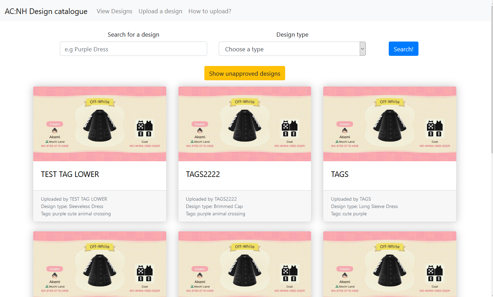
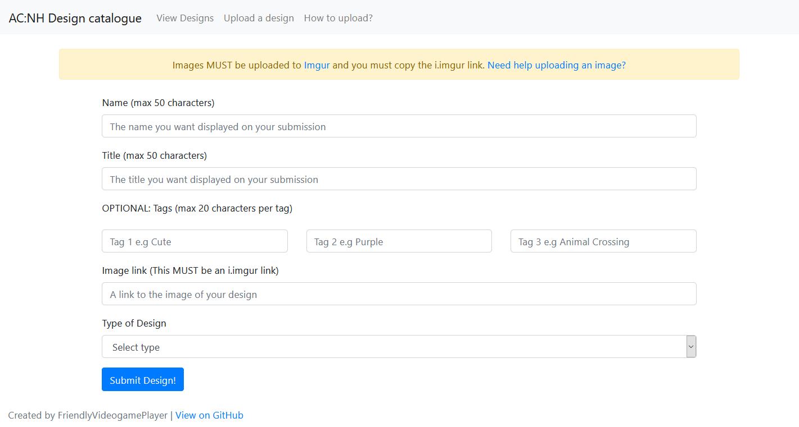

# ACNH: Design Catalogue
This was going to be a site where users could share their shareable codes in the game Animal Crossing: New Horizons for designs. Unfortunately someone else managed to finish this concept before I did and has gathered a large userbase in just a matter of hours and so this project is now on hold, possibly retired.

The site is fully functional, the only thing that was left to do was protecting the /approvedesigns page so regular users wouldn't be able to access it.

## How it works?
The site works by users going to the upload page and then filling in the form and linking an image for their design. The design is then added to the DB but has a value of 0 in the approved column. On the designs page only designs with an approved value of 1 get displayed. There is a view to view the unapproved designs by clicking on the button on the designs page however it is accompanied by a warning since those designs might not be appropiate. Once a design is approved in the /approvedesigns page it will then be visible and searchable on the main designs page.

## Set up
This project is built using laravel and so to install and use it you will need Composer installed on your server/PC.
* [Laravel](https://laravel.com/) 
* [Composer](https://getcomposer.org/) 

Move this project folder to your webserver/XAMPP web root (XAMPP/htdocs or /var/www) and simply cd/to/project/directory and run 

```
composer install
```

Once the dependencies are installed you will need to edit the .env file with your details and then you will then need to run the DB migration to get your DB tables set up. This can be done by typing the following command within the project directory.

```
php artisan migrate
```

After that you should be set up to use the project!

If you are forking this project all I ask is that you please link back to this original repo within your fork.

## Screenshots

#### Designs page 



#### Unapproved designs page 


#### Upload page



#### Admin approval page

